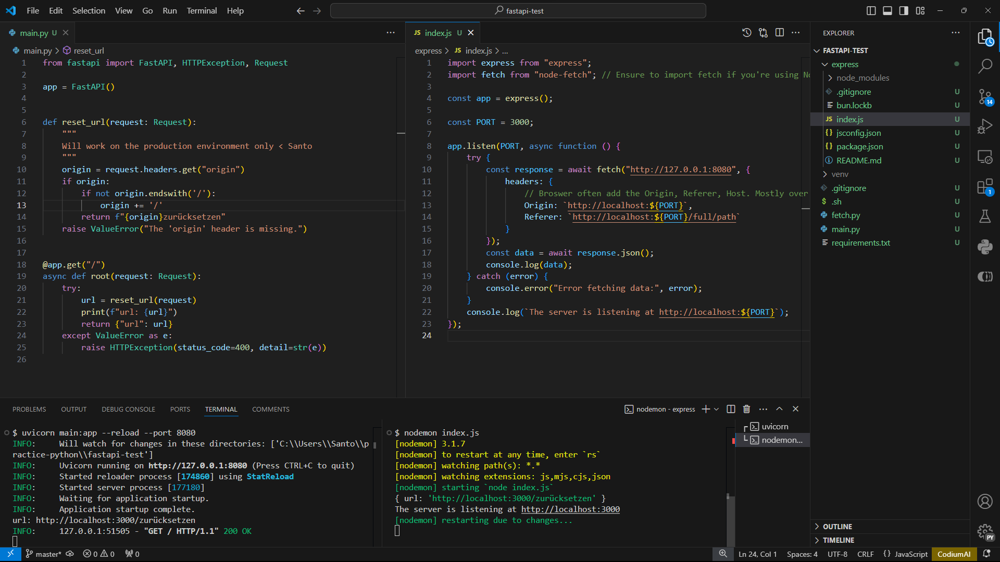
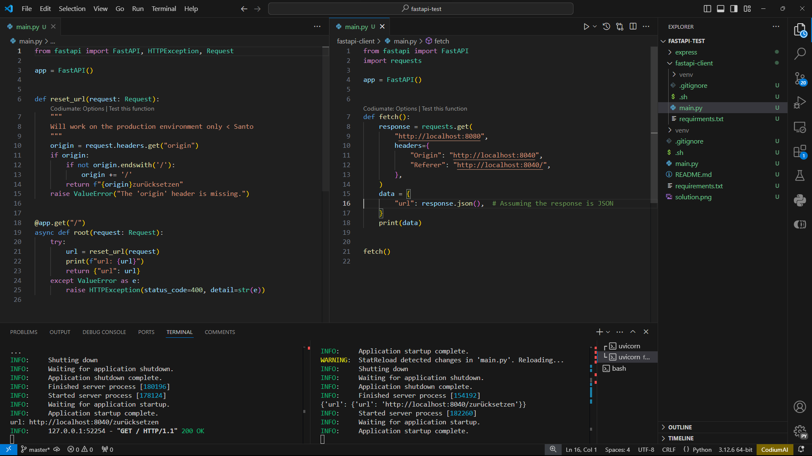

# How determine Oirign and Referer page URL on the server

## The solution is here

FastAPI + Express



FastAPI + FastAPI



## FastAPI

To install dependencies:

```sh
python -m  venv venv
source venv/Scripts/activate
pip install fastapi uvicorn requests
exit
```

To run;

```sh
source venv/Scripts/activate
uvicorn main:app --port 8040 --reload
```